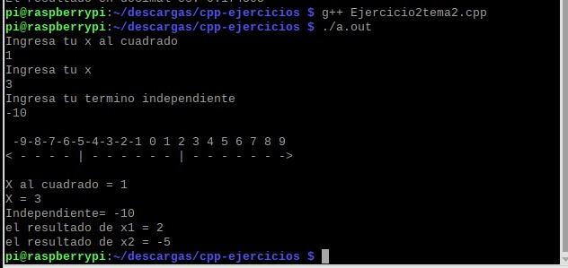
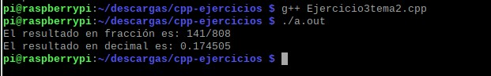
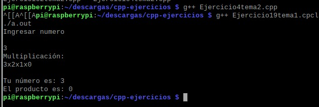

# 2.2quemu

#    Tecnológico Nacional de México
#   Instituto Tecnológico de Tijuana
#        Subdirección Académica

# Departamento de Sistemas y Computación
# Ingeniería en Sistemas Computacionales
# Lenguajes de interfaz 

# Practica Bloque: 📝Bloque: 2.2
# Objetivo: Elabora la QEMU de RaspberryPI virtual y corra sus programas de CPP.

# 📝 Garcia Rosas Jeshua Emmanuel, 18212188
   

# Profesor:
# MC. René Solis Reyes
# Semestre sep - ene 2020

-----

